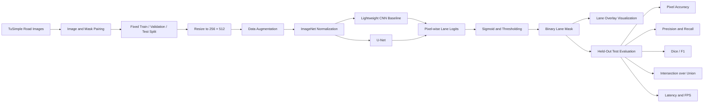

# Autonomous Driving Lane Detection

PyTorch implementation of an end-to-end lane segmentation pipeline for autonomous driving using the TuSimple dataset.

---


---

## Overview

This project benchmarks a lightweight CNN baseline against a U-Net architecture for pixel-wise lane segmentation.

The complete pipeline includes

- Dataset preprocessing
- Train / Validation / Test split generation
- Data augmentation
- CNN and U-Net models
- Training & checkpointing
- Quantitative evaluation
- Prediction visualization
- Training curves
- Model comparison

---

## System Architecture



---

## Held-Out Test Results

Evaluated on a fixed held-out test set of **363 TuSimple road images**.

| Model | Parameters | Pixel Accuracy | Precision | Recall | Dice / F1 | IoU | Throughput |
|---|---:|---:|---:|---:|---:|---:|---:|
| Lightweight CNN | 34,401 | 95.16% | 53.25% | 52.88% | 53.07% | 36.12% | **238.73 FPS** |
| U-Net | 7,763,041 | **97.61%** | **76.09%** | **78.46%** | **77.26%** | **62.94%** | 22.20 FPS |

U-Net improved Dice/F1 by **24.19 percentage points** and IoU by **26.82 percentage points** over the lightweight CNN baseline, while the baseline delivered substantially higher inference throughput.

---

## Qualitative Results

The comparison visualization uses:

- **Yellow:** correctly predicted lane pixels
- **Green:** missed ground-truth lane pixels
- **Red:** false-positive lane pixels


## Training Curves

### U-Net Loss


### U-Net Dice Score


## Model Comparison


## Dataset Sample


---

## Dataset

Dataset:
TuSimple Lane Detection Benchmark

Total Images:
3,626 road scenes

Split

- Train: 2,900
- Validation: 363
- Test: 363

Image Resolution

256 × 512

---

## Model Performance

| Model | Pixel Accuracy | Dice | IoU | Precision | Recall |
|------|------|------|------|------|------|
| Baseline CNN | 95.16% | 53.07% | 36.12% | 53.25% | 52.88% |
| U-Net | **97.61%** | **77.26%** | **62.94%** | **76.09%** | **78.46%** |

---

## Qualitative Results

### U-Net Predictions


### Training Curves


### Model Comparison


---

## Repository Structure

```
autonomous-lane-detection/

configs/

data/

outputs/

src/

requirements.txt

README.md
```

---

## Training

Train Baseline

```bash
python src/train.py \
--model baseline \
--epochs 15
```

Train U-Net

```bash
python src/train.py \
--model unet \
--epochs 15
```

---

## Evaluation

```bash
python src/evaluate.py \
--model unet \
--split test
```

---

## Prediction

```bash
python src/predict.py \
--model unet \
--split test
```

---

## Technologies

- Python
- PyTorch
- OpenCV
- NumPy
- Albumentations
- Matplotlib
- TuSimple Dataset

---

## Results

The U-Net model achieved

- 97.61% Pixel Accuracy
- 77.26% Dice/F1
- 62.94% IoU

on the held-out TuSimple test set.

---

## Future Work

- DeepLabV3+
- Attention U-Net
- ENet
- Real-time deployment
- CARLA Simulator integration

---

## Author

Sai Sri Krishna Teja Sanku

University of Florida