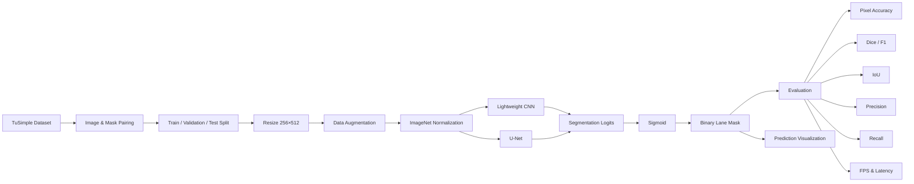
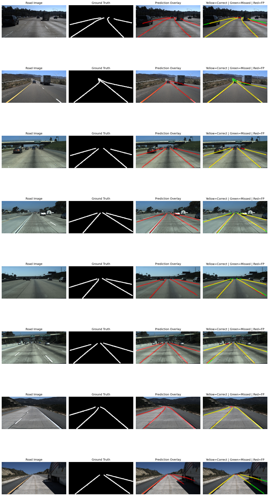
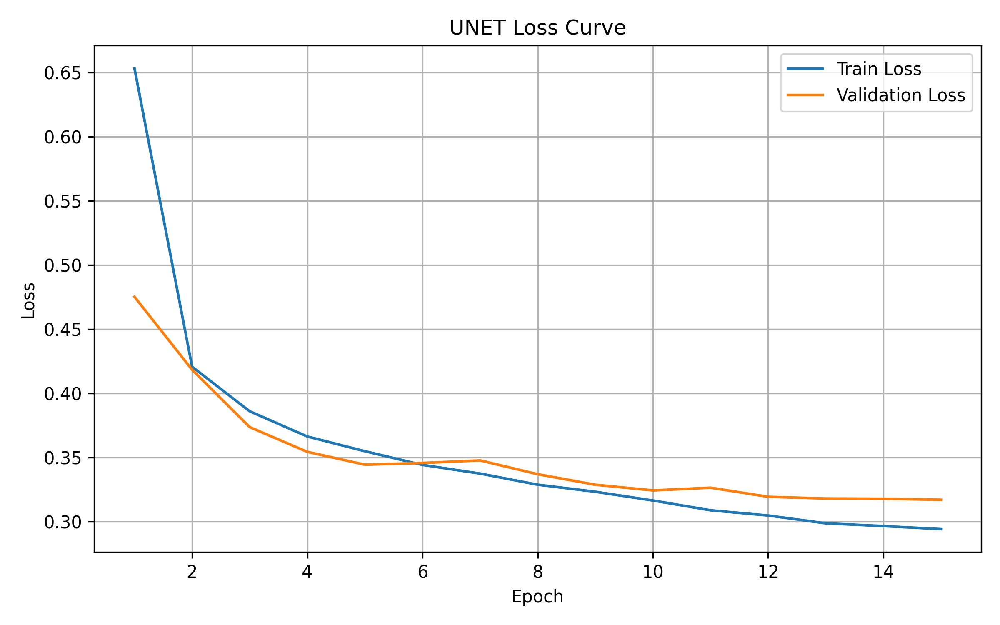
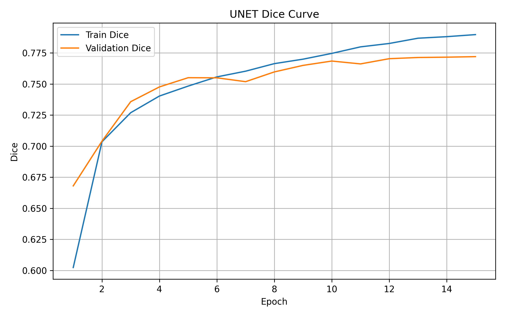
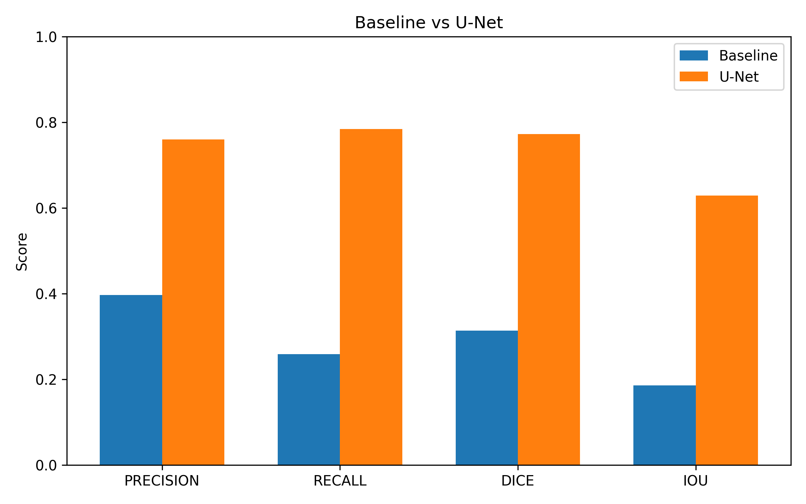
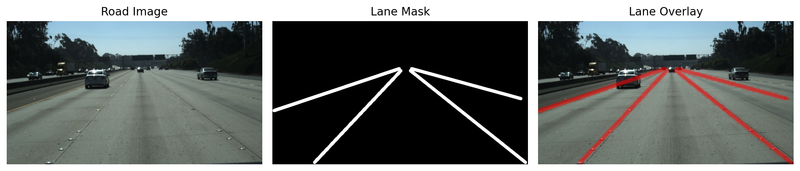

# Autonomous Driving Lane Detection using Deep Learning

| | |
|---|---|
| **Institution** | SRM Institute of Science and Technology |
| **Project Duration** | 2024–2025 |
| **Project Type** | Undergraduate Research Project |
| **Faculty Guide** | Dr. Godwin Ponsam J |
| **Dataset** | TuSimple Lane Detection Benchmark |
| **Framework** | PyTorch |

PyTorch implementation of an end-to-end lane segmentation pipeline for autonomous driving using the TuSimple Lane Detection Benchmark.

---


---

# Overview

Autonomous driving systems require accurate lane perception for safe vehicle navigation. This repository presents a complete deep learning pipeline for semantic lane segmentation using the TuSimple Lane Detection Benchmark.

The project compares a lightweight CNN baseline against a U-Net segmentation model through quantitative evaluation, qualitative visualization, and runtime benchmarking.

---

## Project Background

This project was originally developed as an undergraduate research project
at SRM Institute of Science and Technology (2024–2025)
under the guidance of Dr. Godwin Ponsam J.

The research team consisted of:

- Sai Sri Krishna Teja Sanku
- Harshith Kalyanam
- Likhitha Pulluru

This repository contains the implementation, experimental results, visualizations, and supporting documentation developed during the undergraduate research project.

---

## Research Paper

The original undergraduate research paper associated with this project is included in the `research/` directory.

**Title:**
*Deep Learning in Autonomous Vehicles: A Comprehensive Review of Object Detection, Lane Detection and Scene Perception*

---

## Team Contributions

| Team Member | Contributions |
|-------------|-----------------------|
| **Sai Sri Krishna Teja Sanku** | Model implementation, training pipeline, evaluation, visualization |
| **Harshith Kalyanam** | Research methodology, literature review, experimental analysis |
| **Likhitha Pulluru** | Dataset analysis, related work, documentation, validation |

---

# Features

- End-to-end semantic lane segmentation
- TuSimple dataset preprocessing
- Automatic train/validation/test split generation
- Albumentations data augmentation
- Lightweight CNN baseline
- U-Net implementation
- Dice + BCE hybrid loss
- Checkpoint saving
- Quantitative evaluation
- Prediction visualization
- Runtime benchmarking
- Publication-quality training curves
- Model comparison plots

---

# System Architecture



---

# Dataset

**Dataset**

TuSimple Lane Detection Benchmark

Total Images

```
3626
```

Split

| Dataset | Images |
|---------|--------|
| Training | 2900 |
| Validation | 363 |
| Test | 363 |

Image Resolution

```
256 × 512
```

---

# Experimental Results

Evaluation performed on the held-out TuSimple test set.

| Model | Parameters | Pixel Accuracy | Precision | Recall | Dice/F1 | IoU | Throughput |
|------|-----------:|--------------:|----------:|-------:|--------:|------:|-----------:|
| Lightweight CNN | 34,401 | 95.16% | 53.25% | 52.88% | 53.07% | 36.12% | **238.73 FPS** |
| U-Net | 7,763,041 | **97.61%** | **76.09%** | **78.46%** | **77.26%** | **62.94%** | 22.20 FPS |

### Key Observation

Compared to the lightweight CNN baseline, the U-Net achieved

- +24.19% Dice/F1
- +26.82% IoU
- +22.84% Precision
- +25.58% Recall

while providing substantially higher segmentation accuracy than the lightweight CNN baseline, with practical inference speeds for research and offline evaluation.

---

# Qualitative Results

Prediction visualization

Color legend

- 🟨 Yellow → Correct prediction
- 🟩 Green → Missed lane pixels
- 🟥 Red → False positive prediction



---

# Training Curves

### U-Net Loss



### U-Net Dice Score



---

# Model Comparison



---

# Dataset Sample



---

# Repository Structure

```
Autonomous-Lane-Detection
│
├── configs/                  # Configuration files
├── data/                     # Dataset splits
├── outputs/
│   ├── checkpoints/
│   ├── figures/
│   ├── metrics/
│   └── predictions/
├── research/
│   ├── Deep_Learning_in_Autonomous_Vehicles.pdf
│   └── README.md
├── src/
│   ├── train.py
│   ├── evaluate.py
│   ├── predict.py
│   ├── dataset.py
│   ├── models.py
│   └── utils.py
├── requirements.txt
├── LICENSE
└── README.md
```

---

# Installation

Clone the repository

```bash
git clone https://github.com/krishnatejasai/Autonomous-Lane-Detection.git

cd Autonomous-Lane-Detection
```

Install dependencies

```bash
pip install -r requirements.txt
```

---

# Training

Train the baseline model

```bash
python src/train.py \
--model baseline \
--epochs 15
```

Train U-Net

```bash
python src/train.py \
--model unet \
--epochs 15
```

---

# Evaluation

Evaluate the trained model

```bash
python main.py evaluate \
--model unet \
--split test
```

---

# Prediction

Generate prediction visualizations

```bash
python src/predict.py \
--model unet \
--split test
```

---

# Technologies

- Python
- PyTorch
- OpenCV
- Albumentations
- NumPy
- Matplotlib
- TuSimple Dataset

---

# Future Work

- DeepLabV3+
- Attention U-Net
- ENet
- MobileNetV3 Segmentation
- Real-time deployment
- TensorRT optimization
- CARLA simulator integration
- Multi-camera lane fusion

---

# License

Released under the MIT License.

---

## Acknowledgements

This work was carried out as an undergraduate research project at
SRM Institute of Science and Technology under the guidance of
**Dr. Godwin Ponsam J**.

Research Team:

- Sai Sri Krishna Teja Sanku
- Harshith Kalyanam
- Likhitha Pulluru

The original project report is included in the `research/` directory.

